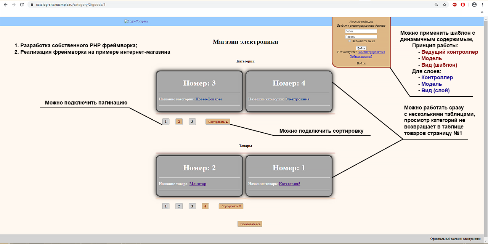
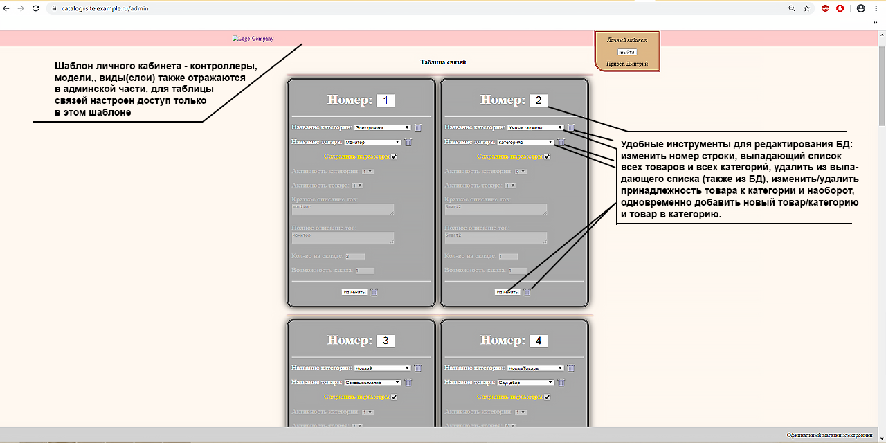
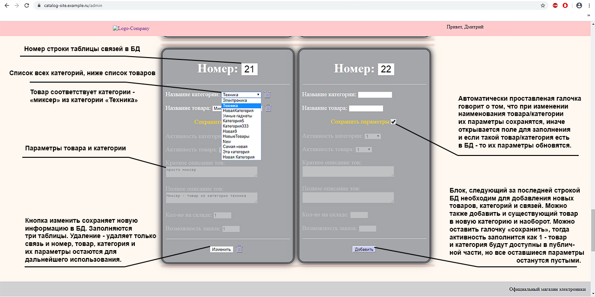

# Пишем свой фреймворк - версия 9

## Описание:

PHP MVC-Фреймворк, с помощью которого можно быстро создавать как простые, так и сложные структурированные сайты. Подготовлен пример интернет-магазина, для ознакомления с функционалом фреймворка. Кратко о фреймворке:
+ все модели, виды, контроллеры должны обязательно наследовать из родительских классов, так как это позволяет достаточно быстро создавать собственные контроллеры, модели, виды и короткими методами подключаться к БД, вызвать пагинацию, добавить кнопку сортировки данных, кроме этого можно легко получить номер текущей страницы, количество записей в БД, номер текущей записи для LIMIT, максимальное количество записей, путь до и после текущего контроллера, текущий контроллер с его методом; 
+ добавлена система шаблонов и слоев, при этом если в шаблонах нет необходимости - можно работать без них;
+ каждый контроллер помнит весь путь url вместе со страницей, это значит, для ссылок используется одинаковый код, уходит проблема с ЧПУ;
+ исходя их предыдущего пункта - каждый контроллер можно вызвать где угодно, можно менять местами(но можно задать и ограничения),
+ предполагается использование только одного шаблона одновременно, если в ссылке обнаружены другие - они будут проигнорированы (можно задать ограничение), использование вложенности шаблонов в шаблонах также допустимо при внесении изменений (см. ниже)
+ фреймворк работает без GET-запросов, пагинация построена на простом массиве и парсинге без регулярных выражений, кнопки, работающие с БД используют метод POST;
+ не используется java-script, только PHP, HTML, CSS и Flexbox.

## ШАБЛОНЫ/СЛОИ

 Добавлена система шаблонов/слоев - если необходим шаблон - запускаем роутер в начале вида - роутер запустит все: контроллеры, модели, виды, если с ними работает пользователь
( пример: $content->addRoute() ). Однако $content->addRoute() хоть и производит все операции, он ничего не отражает, метод render() в каждом файле контроллера выводит только
текущую страницу и сохраняет ее данные в методе того же класса render2(). Метод render2() не хранит в себе лишнюю информацию, только ту, что запрашивает пользователь,
однако если выводить сразу множество таблиц - все данные сохранятся. Если необходимо запускать сразу множество шаблонов, то в первую очередь необходимо устроить подключение
нескольких файлов в View.php медод render(); В методе роутера mainRoute() описываем как и когда запускать шаблон (шаблон-MVC),

можно изменить вид всех слоев - просто изменить html код шаблона.
в даный момент все контроллеры вызываются как в публичной части так и в админской - можно задавать ограничения в роутере
шаблонов и видов может быть сколько угодно

принцип работы:
 config запускает метод mainRoute() - этот метод запускает контроллер, который в свою очередь вызывает шаблон, последний подключает роутер.

## ФАЙЛЫ:

index.php - точка входа
route - управляет подключением контроллеров/моделей и вызывает ошибки
config - константы контроллера/модели/вида
bd - поключение к БД

## КОНТРОЛЛЕРЫ:

default - общий вид сайта, header/footer, кнопка домой, форма регистрации
goods - таблица товаров +фильтр товаров (если категория выбрана в контроллере table)
category - таблица категорий
tables - страница выбранного товара, отражает все категории товара, с выбором категорий
admin_table - таблица связей для внесения изменений в БД
admin - контроллер редактирования БД, (в разработке)
out - контроллер выхода - завершает сессию и покидает админ-часть

## ВИДЫ:

шаблоны main.tpl.php и admin.tpl.php
остальные реализованы как слои

## ОШИБКИ и НЕДОЧЕТЫ:

1. ошибка с вызовом header в шаблоне, если роутер вызывается не на первой строке. Временное решение - вызывать header напрямую из роутера (29.12.2019 - исправлена)
2. ранее была ошибка с обновлением записей в БД - если изменять сразу и категорию и товар и описание - то сначала изменения вносились в предыдущие записи, а после обновления страницы
    в новые. Пример, есть третья строчка таблицы - телевизор из категории электронника и описание товара, изменяем на холодильник из категории быт. техника и описание нового товара -
    в БД меняется описание товара телевизор, все остальное корректно. Обновляем страницу - теперь наконец меняется описание товара Холодильник (06.01.2020 - исправлена)
3. Ошибка при добавлении в БД категории и товара при наличии такого пункта (07.01.2020 - исправлена)

4. В данный момент методы изменения и добавления в БД находятся в модели adminTableModel, а не в родительском классе Model (возможно будут перенесены для создания CRUD);
5. возможны ошибки при визуальном оформлении (стили css и flexbox);
6. + В данный момент не добавлено перенаправление после внесения данных в БД, обновление страницы не приведет к ошибке (протестировано), однако те же строки в БД снова обновляются; (09.01.2020 - исправлена)
   + Очень удобный способ добавлять новые данные, однако стоит учитывать, что при добавлении такого же товара, но новой категории требует снова прописывать описание товара - решение
         добавить галочку (сохранить предыдущие данные). (17.01.2020 - исправлена)
   + Данные в таблице товаров сортируются не по дате добавления, а по имени - и второй момент ссылки на новые товары отмечены как посещеные, и наоборот на старые товары как активные.

7. Сортировка в таблице редактирования БД по 'num' исправлена на 'idB'; num - это снова пронумерованые поля - благодаря этому достигается красивая нумерация,
      однако если в БД есть 20 записей - но 21 добавить под номером 23, то в БД будет номер 23, а отражаться все равно 21, теперь если добавить еще запись,
      дойти до номера 23 - запись добавлена не будет, так как этот номер был занят ранее, ошибка также не выводится. (17.01.2020 - исправлена)

## !!!Подсказки по созданию контроллеров, моделей, видов!!!

### 1. Создать контроллер

class adminController extends Controller{
 private $pageTpl = "/views/admin.tpl.php";
  public function __construct() {
   $this->model = new adminModel();
   $this->view = new View();
  }
 public function default() {
  View::render($this->pageTpl, $this->pageData); //вызвать вид
 }

+ Если будет пагинация то обязательно:

  public function page() {
   $this->default(); //вернется в контроллер, всю остальную информацию берет из родительских классов
  }

+ Далее создаем свои методы.

### 2. Создать модель

+ подключение реализовано в родительском классе Model

class adminModel extends Model {
 public static $id = idG; //здесь указываем поле по которому считаем количество записей БД (нужно для пагинации)
 public $maxNotes = 1;// сколько строк выводить на этой странице (нужно для пагинации)
  public function goods_tables() {
                                              //запрос в базу данных 1) указать группировку 2) указать LIMIT: 0 - показывать все, 1 - постранично
                                              //3) ограничение where - где 0 - отключить, а любой текст соответствует наименованию категории
    $result = self::goods_table(name, 1, 0);
    return $result;
  }
}

### 3. Создать вид

+ Если шаблон - добавить: $content->addRoute(), а также перед html тегами - $content->startRoute('название шаблона').
Нет обязательных требований.

+ Из роутера в каждый контроллер передается имя вызванного контроллера - теперь при создании
нового вида можно использовать переменные, вместо того чтобы везде прописывать имя контроллера

  + Пример: пагинация - ожидаемый url

    + http://catalog-site.example.ru/goods/1/ - где goods - контроллер goodsController
    + http://catalog-site.example.ru/category/1/ где category - categoryController,

  + вместо этого используется одинаковая конструкция:

    + http://catalog-site.example.ru/$pageData[saveUrlBefore]/$pageData[save]/$i/$pageData[saveUrlAfter]
      + где:
        + $pageData[saveUrlBefore] = сохраненый путь до контроллера
        + $pageData[saveUrlAfter] = сохраненый путь после контроллера и его действия
        + $pageData[onlyTemplate] = имя шаблона - ситуация когда не нужно сохранять путь до контроллера, а просто вернуться в основную дирректорию шаблона

      + пример:
        + вместо http://catalog-site.example.ru/admin/category/1/goods/1/table/3
        + http://catalog-site.example.ru/admin/table/3 - где admin - это шаблон
        + $pageData[save] = имя текущего контроллера (goods, category, table, admin и тд.)

  + Кнопка "показывать все" просто отправляет по ссылке /category/1/goods/1/
путь сохраняется только в пределах этой ссылки или изменений урл напрямую пользователем
кнопка находится в шаблоне

### Принцип работы метода пагинация:

+ В контроллере:

 $pagination = $this->model->Pagination('category'); // Подключение пагинации (прописываем 'category')
 $this->pageData['pagination'] = $pagination; // Отдать в Вид

+ В виде:

 echo($pageData['pagination']);

  + принцип:

 модель не трогаем - метод уже есть в родительской модели. Текущий контроллер его запустит и передаст ссылку(ссылку вносим сами).
 ссылка не что иное, как имя контроллера, одако внести это имя необходимо, так как пока контроллер не запущен - имя еще не известно.
 Метод пагинация сам вычисляет количесвто страниц на текущем контроллере, возвращает строку ссылок по типу 1 2 3 ...

## ПОСЛЕДНИЕ ИЗМЕНЕНИЯ:

+ 05.12.2019 - сокращен код в моделях и контроллерах
+ 10.12.2019 - добавлена система шаблонов/слоев, оптимизация работы
+ 17.12.2019 - пагинация теперь просто вызывается из вида; упрощена работа метода user_account; добавлена иконка
+ 20.12.2019 - визуальные изменения файла error-404, ошибки вынесены в отдельный метод роутера, включаются в файле config.php,
                способ вызов роутера из шаблона упрощен (создание класса теперь вынесено в View.php)
+ 26.12.2019 - переоформление: теперь можно в виде вызвать табличное (echo($pageData['printTable'])) оформление или блочное
                (echo($pageData['printDiv']))
                отображение пагинации в виде (echo $pageData['pagination']), добавлен метод перевода любого массива в обычный текст; стили теперь подключаются отдельно
+ 29.12.2019 - теперь роутинг запускается в начале шаблона, а его контент где угодно методом render(); теперь есть проверка на
                наличие вызываемого метода в контроллере - добавлены новые проверки на вызов 404.php; если url заканчивается на '/' вызывается ошибка, убраны лишние '/' при переходах; протестирован на ошибки.
+ 06.01.2020 - Работа с flexbox, визуальное оформление (теперь контент с блоками выталкивает блоки 'логотип' и 'вход' (header),
                что-то наподобие vk.com);
                Программирование: решение использовать АНОНИМНУЮ ФУНКЦИЮ (см. метод printDiv() в adminTableModel) - теперь список всех товаров и всех категорий открывается прямо в таблице заполнения БД, стандартно показывается актуальный пункт строки таблицы, но его можно изменить,
                актуальность товара и категории теперь тоже в расскрывающемся списке (но не всех товаров и категорий, а только текущего и обратное значение - если товар активен, то "1" - и обратная цифра "0" и наоборот) теперь можно корректно заполнять БД
+ 07.01.2020 - Исправления: была ошибка с выводом последней записи таблицы товаров($key в цикле переименован в $key2); была  
                ошибка при добавлении в БД категории и товара при наличии такого пункта (добавлены ON DUPLICATE KEY UPDATE).
+ 09.01.2020 - Исправления: данные из БД выводились в отсортированном виде по idB (нумерация выглядела 1, 4, 2, 3, 5, 7 ..),
                теперь по num. Добавлено перенаправление - при внесении в БД не теперь не нужно обновлять страницу.
                Методы вызова шаблона и работы с видами в роутере переписаны, код стал проще, и теперь можно ловить все возможные ошибки. Добавлены новые проверки ошибок в роутер.
+ 12.01.2020 - Теперь можно добавить кнопку "сортировать" в контроллер, если кнопка необходима, то прописывается дополнительно
                четвертым пунктом наименование кнопки в модели при запросе в БД ($result = self::goods_table(GROUP BY строка или 0, LIMIT 0 или 1, WHERE строка или 0, 'Имя кнопки').
                Также разрешаем контроллеру исользовать метод и прописываем наименование кнопки ($this->model->createSortButton('имя кнопки'). Каждой таблице можно задать отдельную кнопку.
+ 17.01.2020 - Исправлена верстка html - пункт 'войти в личный' кабинет всегда перекрывал функционал кнопок, теперь перекрывает
                только когда форма вызвана.
                Исправления: данные из БД выводились в отсортированном виде по num, теперь снова по idB но и порядок по idB (описание ошибки см. выше) - теперь можно корректно добавлять новые записи и указывать номер строки таблицы;
                Теперь есть автоматически проставленая галочка "сохранить даные" при добавлении новой записи в БД - если требуется добавить уже существующий товар в уже существующую категорию - то есть создать новую связь - то описание товара и категории автоматически загружаются;
                если необходимо добавить новый товар или новую категорию, то галочка убирается - появляется возможность вносить описание и другие параметры. Достук к заполнению даных после снятия галочки реализован на CSS (не PHP)
+ 20.01.2020 - Добавление кнопок удаления (можно удалить конкретную строку таблицы связей, или удалить конкретный товар -    
                категорию, что также влияет на таблицу связей. Не обязательно для удаления искать конкретный блок - можно выбрать любой блок, раскрыть список товаров/категорий,
                выбрать и нажать на кнопку удалить возле соответствующего списка. Так как запрос на обновление и удаление довольно схожи - все 4 кнопки управляются одним методом Update() ). Кнопка сохранения данных теперь проставляется на каждый блок, т. е. теперь можно изменить
                товар категории, или категорию товара, а описание товара и параметры категории затронуты не будут. Теперь можно изменить номер строки, если строка уже есть в БД - выводится ошибка.

                На текущий момент система редактирования БД позволяет горазда удобнее и быстрее добавлять, изменять, обновлять и удалять данные в БД.

###  Роутер:

+ Пункт 1: заканчивается на слэш - вызвать ошибку или перенаправить на страница-1, настраивается в route.php
  + = стандартный шаблон - стартовая страница
  + / = стандартный шаблон - стартовая страница
  + Контроллер = (применяет стандартный шаблон)/Контроллер/(страница-1);
  + Контроллер/ = (применяет стандартный шаблон)/Контроллер/(аналогично пункту 1);
  + Контроллер/Число = (применяет стандартный шаблон)/Контроллер/(метод контроллера page определяет страницу);
  + Контроллер/Число/ = аналогично пункту 1;
  + Контроллер/Действие = (применяет стандартный шаблон)/Контроллер/(метод контроллера)
  + Контроллер/Действие/ = аналогично пункту 1;
  + Шаблон = шаблон;
  + Шаблон/ = аналогично пункту 1;
  + Шаблон/Контроллер/Действие = аналогично, но внутри указаного шаблона;
  + Шаблон/Контроллер/Действие/Контроллер/Действие = аналогично
  + Шаблон/Шаблон/Контроллер/Действие = шаблон должен быть на первом месте, остальные игнорируются, ошибка не вызывается

+ Пункт 2: ХХХ - это неизвестный контроллер (файл) или неизвестный метод запущенного контролллера;

  + ХХХ = ошибка;
  + ХХХ/ = ошибка;
  + Шаблон/ХХХ = ошибка;
  + Шаблон/ХХХ/Контроллер/Действие = не важно задан ли в роутере на ошибки header() или include(404.php) - работа со всеми таблицами будет недоступна

+ Пункт 3: Кнопка на главную: Route::$templateName это имя шаблонах

  + Контроллер/Действие = выход на Стартовую страницу;
  + Шаблон/Контроллер/Действие = выход в Шаблон;

## Дополнительно:

   До этого момента все обращения в БД решались одним методом и одной таблицей (создание сложной таблицы со связями), теперь добавлен еще один запрос на создание простой таблицы и можно изменить имя таблицы:
      goods_simple_table($table, $columnId = '', $column2 = ''), где $table - имя таблицы, $columnId = '' - это id, и $column2 = '' это колонки (перечислять через запятую, и заключить в кавычки).
         Используется сейчас только для отображения в таблице админстрирования вложенного списка всех товаров или категорий из БД без ограничений.

   Добавлен метод (будет доработан) в роутер startRoute() - теперь имя шаблона передается заранее перед html тегами: <?php $content->startRoute('default') ?>
      используется для видов account.tpl и accaunt.exit.tpl, (и для всех остальных) теперь кнопка "на главную возвращает в текущий шаблон", для выхода из админ нужно выйти

## Оформление:

